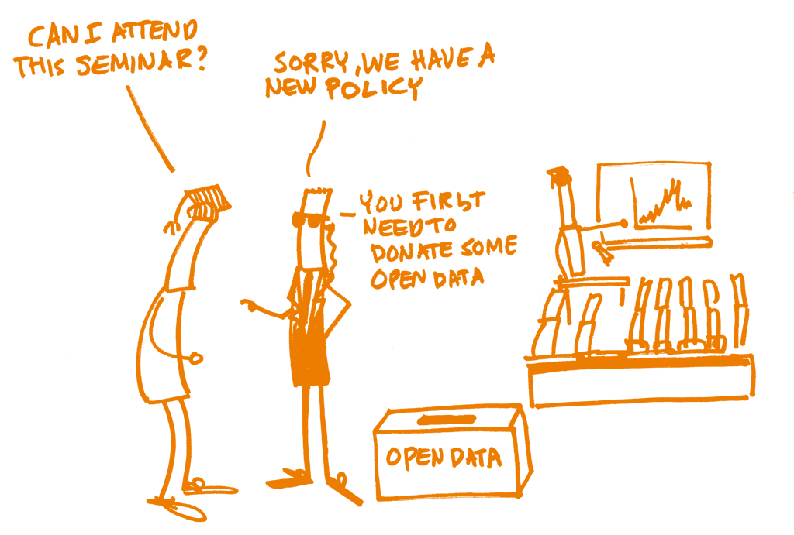

## 
## 9. Políticas de ciencia abierta

### ¿Qué son?

Las políticas de Ciencia Abierta se podrían definir como aquellas estrategias y acciones encaminadas a la promoción de los principios de la Ciencia Abierta y a reconocer las prácticas de Ciencia Abierta. Usialmente, estas políticas son establecidas por instituciones que llevan a cabo investigación, patrocinadores, gobiernos o editoriales. En un principio estas políticas estaban orientadas a la necesidad de difundir –de manera abierta– los resultados de investigación, partiendo del reconocimiento de que los hallazgos de la investigación financiada con recursos públicos, deberían estar disponibles para el público sin restricción alguna. No obstante, actualmente, el alcance de las políticas de Ciencia Abierta se ha ampliado de tal forma que podemos encontrar políticas nacionales que impulsan prácticas de Ciencia Abierta a partir de cualqueir tipo de investigación. Incluso podemos encontrar provisiones específicas en leyes, regulaciones o directrices nuevas y existentes.

## 

> Los dialogos del cómic deben decir:
>
> –	¿Puedo asistir al seminario?
> –	Lo siento, tenemos una nueva política
> –	Primero necesita donar algunos datos abiertos. (Datos Abiertos)

### Fundamentos

Dado que el principal motor de la Ciencia Abierta es la política establecida por instituciones, patrocinadores, gobiernos y editoriales, es importante conocer cómo ello afecta a todo investigador. Si estás planeando diseñar una política enfocada a la adopción y reconocimiento de prácticas de Ciencia Abierta es importante conocer las políticas existentes para evitar cualquier traslape o contradicción. Por tanto, investigadores y responsables de políticas públicas deben conocer las políticas actuales y entender cómo les afectan. 

## 

### Objetivos de aprendizaje

1.	Dependiendo del público, los objetivos de la sesión de capacitación serán diferentes. Podemos dividir de manera general a investigadores (en sentido amplio) y responsables de políticas (dentro de una institución o patrocinadores ¬–en un sentido amplio).

2.	Si tu programa de capacitación está dirigido principalmente a investigadores, de todos los “niveles”, entonces el objetivo principal debería ser revisar cómo las políticas de Ciencia Abierta los afectan.

3.	Si tu programa de capacitación está dirigido a los responsables de las políticas, te podrías enfocar al diseño e implementación de políticas que fomenten la Ciencia Abierta.

4.	Si tu interés es capacitar a patrocinadores o responsables de política dentro de una institución, entonces sería importante mostrarles cómo diseñar, desarrollar, implementar y monitorear dichas políticas.

### Componentes esenciales

## 

#### Conocimiento

Deben revisarse todas las políticas que atañen a quienes participan del proceso de capacitación. En particular se deben revisar las políticas institucionales a nivel interno; por ejemplo: derechos de autor, propiedad intelectual, acceso abierto, datos de investigación.

En segundo lugar, es preciso revisar cualquier política o ley nacional que afecte a los investigadores al momento de llevar a cabo prácticas de Ciencia Abierta; por ejemplo, leyes con previsiones de acceso abierto o decretos que afecten tesis doctorales o convocatorias de proyectos. 

A nivel nacional puede haber algunas leyes o decretos que directa o indirectamente pueden influir en alguna política o suponer algunos requisitos. Por ejemplo, en el caso europeo se podrían revisar las políticas de acceso abierto disponibles en [OPENAire](https://www.openaire.eu/member-states-overview).

Puesto que la ciencia es una labor internacional, es preciso revisar cualquier política internacional que pudiera afectar a tu público objetivo, principalmente aquellas que vienen de patrocinadores internacionales. A nivel Europeo, tenemos políticas que vienen del [H2020 research Framework](https://www.google.com/url?q=https://ec.europa.eu/research/participants/data/ref/h2020/grants_manual/hi/oa_pilot/h2020-hi-oa-pilot-guide_en.pdf&sa=D&ust=1521447690441000&usg=AFQjCNHsEo1FZkHkLDRxIUQr7BpfirASbQ) con relación a la difusión de productos de investigación, pero puede haber otras políticas que afecten a otras partes del ciclo de investigación.

Además, a nivel internacional algunos editores han introducido nuevas políticas, en especial relacionadas con la publicación de datos de investigación al momento de enviar un documento para su posible publicación.

Si el público al cual estás capacitando está dispuesto a desarrollar una hoja de ruta –o agenda– para implementar una política nacional de Ciencia Abierta, sería recomendable hacer una evaluación comparativa de lo que se ha hecho en otras partes del mundo. Como punto de partida, Amsterdam Call for Action 2016 podría mostrar algunos de los problemas que deben considerarse y a quienes están dirigidos. Ejemplos de ([Países Bajos](https://www.openscience.nl/)\), \([Portugal](http://www.ciencia-aberta.pt)\), or \([Finlandia](https://openscience.fi/)) pueden ayudar a planear las políticas nacionales, esbozar algunas acciones y encontrar cómo medir su implementación 

> COMENTARIO: 
>
> Acá sería pertinente mencionar la normatividad en el caso de los países que cuentan con leyes de acceso abierto: Perú, Argentina, México

## 

#### Skills
#### Habilidades

Trainees would need to identify the main features of each policy mainly: to whom is addressed, what are the requirements, how they overlap with each other.

You might show how researchers can fulfil with the different policies: where are the services, the tools that the institution can provide but also where they can find alternatives. For instance, an institution might not provide an infrastructure for depositing and publishing research data; but it can point out external solutions that fulfil policy requirements. It is also useful to compare those solutions with other external options with not desired features.

When designing an Open Science policy, trainees would need to be able to define the main purposes of having such a policy and to establish the goals or changes they are pursuing. Once defined, they must be able to find key performance indicators to measure if the policy have achieved its goals and they must be able to review and update the policy if the goals are not achieved.

Las personas que estés capacitando necesitarán identificar los principales rasgos de cada política, en específico: a quién está dirigida, cuáles son los requerimientos y cómo se traslapan unas con otras.

Puedes mostrarles cómo los investigadores pueden cumplir con las diferentes políticas: dónde están los servicios, las herramientas que la institución puede proveer y también dónde se pueden encontrar alternativas. Por ejemplo, una institución podría no proveer infraestructura para depositar y publicar datos de investigación, pero puede indicar soluciones externas que cumplan con los requerimientos de las políticas diseñadas. También puede ser útil para comparar ciertas soluciones con otras opciones externas, con características no deseadas.

Las personas que estén participando de un proceso de capacitación en materia de Ciencia Abierta necesitan saber cómo definir los propósitos principales de dicha política, así como establecer las metas o cambios que se persiguen. Una vez definidos dichos propósitos, los participantes deben identificar indicadores clave del desempeño para medir si la política ha conseguido sus objetivos; asimismo, deben ser capaces de revisar y actualizar la política en caso de que los objetivos no se llegaran a cumplir.

## 
### Questions, obstacles, and common misconceptions
### Preguntas, obstáculos y conceptos erróneos comunes

The main question coming from researchers in training sessions on policies is how they can fulfill the requirements without losing any freedom on deciding where to publish, for instance. You as a trainer, may describe all the available options researchers have because in general, Open Science policies provide a range of options.

Another question often raised is what happens if researchers don’t fulfil the requirements. In this case you may give examples of projects monitored by funders or warnings received by researchers.

A common misconception regarding research data policy is that researchers should share all data openly. To overcome it, you must highlight the different excerpts in the text of a policy where there are explanations about which is the data affected by the policy and when it must be shared. We might also remark all the opt-out choices that policies include. A good resource to clarify those issues can be an infographic like the [one available from Horizon 2020](https://www.google.com/url?q=https://ec.europa.eu/research/press/2016/pdf/opendata-infographic_072016.pdf&sa=D&ust=1521447690670000&usg=AFQjCNG6Qegy5MwM3bjNJ1ovWp1YlQSswQ).

When planning a policy is important to know what do you intend to achieve or solve. Sometimes policies are created following other initiatives without thinking if there is a need for another one and if your new policy will overlap other existing ones. The main challenge when creating a policy is to align it with other initiatives and to avoid contradictions with laws or regulations.

En las sesiones de capacitación sobre Ciencia Abierta, la pregunta más común por parte de los investigadores es: cómo pueden cumplir con los requisitos, sin perder la libertad de decidir dónde publicar. En este caso, tú como capacitador puedes describir todas las opciones disponibles para los investigadores porque, en general, las políticas de Ciencia Abierta ofrecen un amplio rango de opciones. 

Otra pregunta frecuente es qué pasa si los investigadores no cumplen con los requisitos. En este caso, puedes mencionar ejemplos de proyectos monitoreados por los patrocinadores, o advertencias recibidas por los propios investigadores.

Una concepción errónea común con relación a las políticas de datos de investigación es que los investigadores deben compartir sus datos de manera abierta. Para abordar este tema sugerimos resaltar las diferentes partes del texto de las políticas donde se explique qué tipo de datos serán afectados por las políticas y cuándo deben ser compartidos. Se sugiere también analizar todas las opciones de autoexclusión presentes en las políticas. Un recurso útil para clarificar estos aspectos es la inforgrafía que se encuentra disponible en Horizon2020.

Al planificar una política es importante saber qué es lo que se quiere hacer, y qué es lo que se intenta lograr o solucionar. Algunas veces las políticas se elaboran imitando a otras iniciativas, sin pensar si son neesarias y si la nueva política se traslapará con otras que ya existen. El reto principal al crear una política es alinearla con otras iniciativas y evitar contradicciones con leyes o regulaciones pre existentes. 

## 
### Learning outcomes
### Resultados del aprendizaje 

1. Trainees would be able to identify the requirements of any policy that could affect them when performing Open Science.
2. They would be able to distinguish among general policies like copyright or data protection and specific policies related to Open Science, for instance regarding how to disseminate research outputs. 
3. They would be able to outline the steps to fulfill a certain policy.
4. Trainees attending a session aimed at policy making would be able to plan an Open Science policy, establishing objectives and indicators to measure its implementation.

Las personas que estén siendo entrenadas en el diseño de políticas de Ciencia Abierta, deberán ser capaces de:
1.	Identificar los requisitos de cualquier política que pueda afectarlos, al llevar a cabo prácticas de Ciencia Abierta.
2.	Distinguir entre las políticas generales –como Derechos de Autor o Protección de Datos– y políticas específicas relacionadas con la Ciencia Abierta; por ejemplo: cómo difundir los productos de investigación.
3.	Esbozar los pasos para cumplir con una política determinada.
4.	Planear una política de Ciencia Abierta estableciendo objetivos e indicadores para medir su implementación. 

## 
### Further Reading
### Lecturas recomendadas

* Providing researchers with the skills and competencies they need to practise Open Science. [Report of the Working Group on Education and Skills under Open Science](https://ec.europa.eu/research/openscience/index.cfm?pg=skills_wg).

* Resources available from [Pasteur4OA](http://www.pasteur4oa.eu/), and [LEARN](http://learn-rdm.eu)

* The FOSTER courses [Designing Successful Open Access and Open Data Policies: Introductory](https://www.fosteropenscience.eu/node/2081) and [Designing Successful Open Access and Open Data Policies: Intermediate](https://www.fosteropenscience.eu/node/2075)

* HowOpenIsIt?. [Guide to Research Funders Policies](http://www.orfg.org/resources/) by Open Research Funders Group & SPARC

•	Providing researchers with the skills and competencies they need to practise Open Science. Report of the Working Group on Education and Skills under Open Science.

•	Recursos disponibles a través de Pasteur4OA, y LEARN

•	Los cursos FOSTER Designing Successful Open Access and Open Data Policies: Introductory y Designing Successful Open Access and Open Data Policies: Intermediate

•	How Open Is It? Guide to Research Funders Policies de Open Research Funders Group & SPARC.
